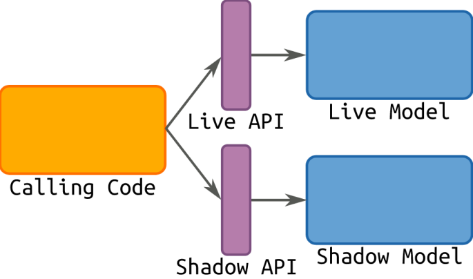
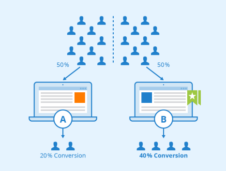
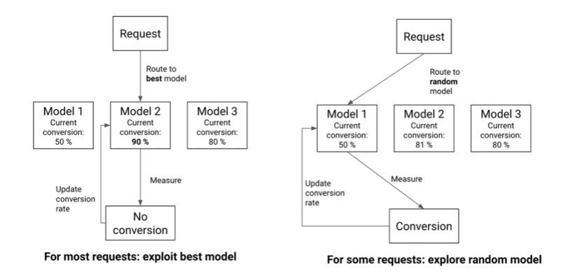
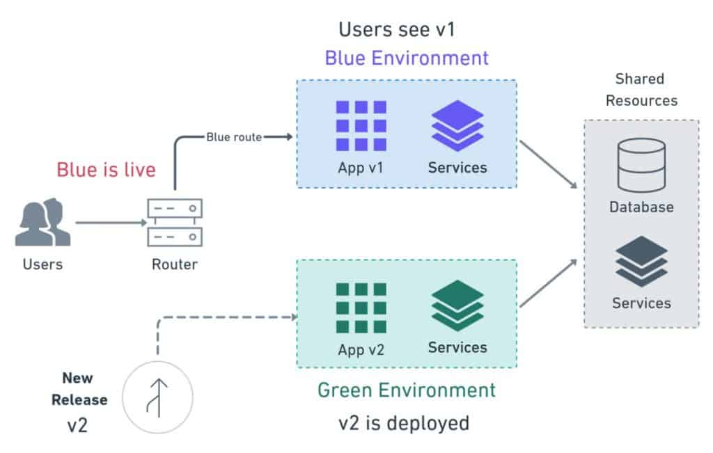
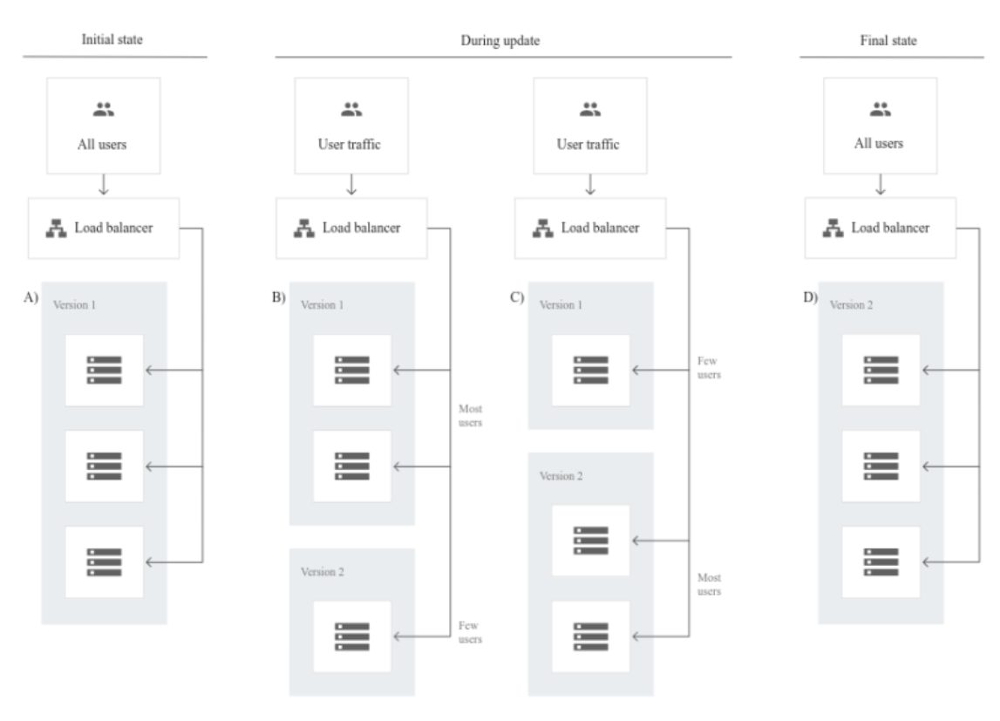
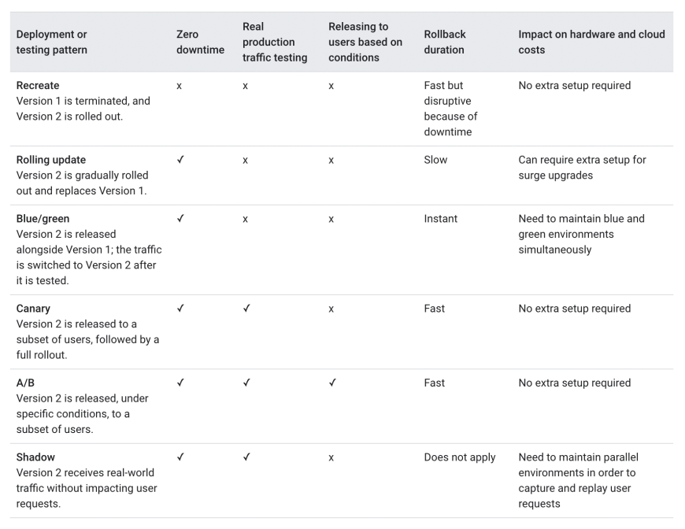

# MLOps Note & Research
*Patcharanat P.*

## Table of Contents
1. [Three Levels of ML Software](#1-three-levels-of-ml-software)
    1. [Data: Data Engineering Pipelines](#1-data-data-engineering-pipelines)
    2. [Model: Machine Learning Pipelines](#2-model-machine-learning-pipelines)
    3. [Code: Deployment Pipelines](#3-code-deployment-pipelines)
2. [MLOps Principles](#2-mlops-principles)
    - [Automation](#automation)
    - [Continuous Processes](#continuous-processes)
    - [Versioning](#versioning)
    - [Loosely Coupled Architecture (Modularity)](#loosely-coupled-architecture-modularity)
3. [CRISP-ML(Q)](#3-crisp-mlq)
4. [Designing Machine Learning Systems book - Chip Huyen, O'Reilly 2022](#4-designing-machine-learning-systems-book---chip-huyen-oreilly-2022)
5. [ML Deployment Strategies](#5-ml-deployment-strategies)
    1. [Shadow/Challenger](#1-shadowchallenger)
    2. [A/B Testing Model](#2-ab-testing-model)
    3. [Multi Armed Bandit](#3-multi-armed-bandit)
    4. [Blue Green Deployment](#4-blue-green-deployment)
    5. [Canary Deployment](#5-canary-deployment)
    6. [Other model deployment strategies and techniques](#6-other-model-deployment-strategies-and-techniques)
    7. [Comparison: which model release strategy to use](#7-comparison-which-model-release-strategy-to-use)
- Model Performance Monitoring
- Automate pipeline Re-training Model
- CI/CD/CT (Continuous Training)
- [References](#references)

## 1. Three Levels of ML Software
*https://ml-ops.org/content/three-levels-of-ml-software*

### 1. Data: Data Engineering Pipelines
- Data Ingestion
    - Data Sources
    - Metadata Catalog
- Exploration and Validation (EDA)
    - Use RAD tools: Using Jupyter notebooks is a good way to keep records of data exploration and experimentation.
    - Attribute Profiling:
        - Number of Records
        - Schema & Data Types
        - Numerical attr. profiling (min, max, avg, median)
        - Amount of missing values
        - Distribution
    - Label Attribute Identification
    - Data Visualization
    - Attributes Correlation
- Data Wrangling (Cleaning)
    - Transformations (Feature Engineering related)
    - Outliers
    - Missing Values
    - Not relevant Data: Drop the attributes that provide no useful information
- Data Splitting
    - Rule of thumb: 80% train set

### 2. Model: Machine Learning Pipelines
- Model Training
    - Feature Engineering
        - Discretize continuous features
        - Decompose features
        - Add transformations of features (e.g., log(x), sqrt(x), x2, etc.)
        - Aggregate features into promising new features
        - Feature Scaling
    - Model Engineering
        - ML model specification (code that creates an ML model) should be versioned
        - Train many ML models from different categories using standard parameters.
        - Measure and compare their performance. For each model, use N-fold cross-validation and compute the mean and standard deviation of the performance measure on the N folds.
        - Error Analysis: analyze the types of errors the ML models make.
        - Feature Selection
        - Identify the top three to five most promising models, preferring models that make different types of errors.
        - Hyperparameters tuning by using cross-validation. Random search for hyperparameters is preferred over grid search.
        - Consider Ensemble methods such as majority vote, bagging, boosting, or stacking, should produce better performance than running them individually.
- Model Evaluation
    - ensure it meets original business objectives before serving the ML model in production to the end-user.
- Model Testing
    - Model performance needs to be measured by using the hold-back test dataset to estimate the generalization error by performing the final “Model Acceptance Test”.
- Model Packaging
    - The process of exporting the final ML model into a specific format, *ML Model serialization formats*.
        - ML Model serialization formats
            - In order to achieve a distributable format, the ML model should be present and should be executable as an independent asset.
            - This means that the ML models should work outside of the model-training environment.
            - Language-agnostic exchange formats
                - Amalgamation
                - PMML
                - PFA
                - etc. [Source: Open Standard Models](https://github.com/adbreind/open-standard-models-2019)
            - Vendor-specific exchange formats
                - scikit-learn: `.pkl` as a pickle file
                - SparkML: MLeap file format (JAR for Java Runtime)
                - Tensorflow: `.pb` (protocol buffer)
                - PyTorch: `.pt`
                - Keras: `.h5`
                - etc. [ML Models training file formats](https://towardsdatascience.com/guide-to-file-formats-for-machine-learning-columnar-training-inferencing-and-the-feature-store-2e0c3d18d4f9)
- **Different forms of ML workflows**
    1. **ML Model Training**
        - **Offline Learning** *(aka batch / static learning)*
            - The model is trained on a set of already collected data.
            - After deploying to the production environment, the ML model remains constant until it re-trained because the model will see a lot of real-live data and becomes stale, this called "model decay".
        - **Online Learning** *(aka dynamic learning)*
            - The model is regularly being re-trained as new data arrives, e.g. as data streams.
    2. **ML Model Prediction**
        - **Batch Predictions**
            - The deployed ML model makes a set of predictions based on historical input data. This is often sufficient for data that is not time-dependent, or when it is not critical to obtain real-time predictions as output.
        - **Real-time Predictions** (aka on-demand predictions)
            - Predictions are generated in real-time using the input data that is available at the time of the request.
        - **Model Serving Pattern & Model Prediction Comparison**
            
            - **Offline Learning + Batch Prediction**
                - Forecast
                    - This type of machine learning workflow is widely spread in academic research or data science education.
                    - Usually, we take an available dataset, train the ML model, then run this model on another (mostly historical) data, and the ML model makes predictions.
                    - This ML workflow is not very useful and, therefore, not common in an industry setting for production systems
            - **Offline Learning + Real-time Prediction**
                - Microservices (Web-service) + REST API
                    - The web service takes input data and outputs a prediction for the input data points.
                    - The model is trained offline on historical data, but it uses real-live data to make predictions.
            - **Online Learning + Real-time Prediction**
                - Real-time streaming analytic
                    - The most dynamic way to embed machine learning into a production system is to implement online learning, which is also known as real-time streaming analytics.
                    - *Please note that online learning can be a confusing name because the core learning or ML model training is usually not performed on the live system. We should call it incremental learning; however, the term online learning is already established within the ML community.*
                    - In this type of ML workflow, the ML learning algorithm is continuously receiving a data stream, either as single data points or in small groups called mini-batches. The system learns about new data on the fly as it arrives, so the ML model is incrementally being re-trained with new data. This continually re-trained model is instantly available as a web service.
                    - Technically, this type of ML system works well with the lambda architecture in big data systems. Usually, the input data is a stream of events, and the ML model takes the data as it enters the system, provides predictions and re-learns on these new data. The model would typically run as a service on a Kubernetes cluster or similar.
                    - A big difficulty with the online learning system in production is that if bad data is entering the system, the ML model, as well as the whole system performance, will increasingly decline.
            - **Online Learning + Batch Prediction**
                - Automated ML
                    - An even more sophisticated version of online learning is automated machine learning or AutoML.
                    - AutoML promises training ML models with minimal effort and without machine learning expertise.
                    - The user needs to provide data, and the AutoML system automatically selects an ML algorithm, such as neural network architecture, and configures the selected algorithm.
                    - Instead of updating the model, we execute an entire ML model training pipeline in production that results in new models on the fly. ***For now, this is a very experimental way to implement ML workflows.***
    3. ML Model Type
        - type of machine learning algorithm such as supervised, unsupervised, semi-supervised, and Reinforcement Learning.

### 3. Code: Deployment Pipelines
1. **Model Serving** - The process of deploying the ML model in a production environment.
2. **Model Performance Monitoring** - The process of observing the ML model performance based on live and previously unseen data. In particular, we are interested in ML-specific signals, such as prediction deviation from previous model performance. These signals might be used as triggers for model re-training.
3. **Model Performance Logging** - Every inference request results in a log-record.

In the following, we discuss Model Serving Patterns and Model Deployment Strategies.
- Model Serving Patterns
    - Model serving is a way to integrate the ML model in a software system. Three components should be considered when we serve an ML model in a production environment. The *inference* is the process of getting data to be ingested by a model to *compute* predictions. This process requires ***a model***, ***an interpreter*** for the execution, and ***input data***.
    - Deploying an ML system to a production environment includes two aspects, first deploying the pipeline for automated retraining and ML model deployment. Second, providing the API for prediction on unseen data.
    - **Model-as-Service**
        - Model-as-Service is a common pattern for wrapping an ML model and the interpreter as an independent web service that applications can request through a REST API or consume as a gRPC service.
        
    - **Model-as-Dependency**
        - Model-as-Dependency is probably the most straightforward way to package an ML model. A packaged ML model is considered as a dependency within the software application.
        - For example, the application consumes the ML model like a conventional jar dependency by invoking the prediction method and passing the values.
        - The Model-as-Dependency approach is mostly used for implementing the Forecast pattern.
        
    - **Precompute Serving Pattern**
        - This type of ML model serving is tightly related to the Forecast ML workflow.
        - With the Precompute serving pattern, we use an already trained ML model and precompute the predictions for the incoming batch of data. The resulting predictions are persisted in the database.
        - We query the database to get the prediction result.
        
    - **Model-on-Demand**
        - The Model-on-Demand pattern also treats the ML model as a dependency that is available at runtime. This ML model, unlike the Model-as-Dependency, has its own release cycle and is published independently.
        - The message-broker architecture is typically used for such on-demand model serving.
        - We can imagine such architecture containing input- and output-queues. A message broker allows one process to write prediction-requests in an input queue. The event processor contains the model serving runtime and the ML model. This process connects to the broker, reads these requests in batch from the queue and sends them to the model to make the predictions. The model serving process runs the prediction generation on the input data and writes the resulted predictions to the output queue. Afterwards, the queued prediction results are pushed to the prediction service that initiated the prediction request.
        
    - **Hybrid-Serving (Federated Learning)**
        - It is unique in the way it does, there is not only one model that predicts the outcome, but there are also lots of it. Exactly spoken there are as many models as users exist.
        -  Let us start with the unique model, the one on the server. The model on the server-side is trained only once with the real-world data. It sets the initial model for each user. Also, it is a relatively general trained model so it fits for the majority of users.
        - On the other side, there are the user-side models, which are the real unique models. The devices will train their own highly specialized model for their own user. Once in a while, the devices send their already trained model data (not the personal data) to the server. There the server model will be adjusted, so the actual trends of the whole user community will be covered by the model. This model is set to be the new initial model that all devices are using.
        - The big benefit of this is that the data used for training and testing, which is highly personal, never leaves the devices while still capturing all data that is available. This way it is possible to train highly accurate models while not having to store tons of (probably personal) data in the cloud.
        - But there is no such thing as a free lunch, normal machine learning algorithms are built with homogeneously and large datasets on powerful hardware which is always available for training. With Federated Learning there are other circumstances, the mobile devices are less powerful, the training data is distributed across millions of devices and these are not always available for training.
        
- Deployment Strategies
    
    In the following, we discuss common ways for wrapping trained models as deployable services, namely deploying ML models as Docker Containers to Cloud Instances and as Serverless Functions.
    - Deploying ML Models as Docker Containers
        - As of now, there is no standard, open solution to ML model deployment. As ML model inference being considered stateless, lightweight, and idempotent, containerization becomes the de-facto standard for delivery.
        - One ubiquitous way is to package the whole ML tech stack (dependencies) and the code for ML model prediction into a Docker container. Then Kubernetes or an alternative (e.g. AWS Fargate) does the orchestration. The ML model functionality, such as prediction, is then available through a REST API (e.g. implemented as Flask application)
        
    - Deploying ML Models as Serverless Functions
        - Various cloud vendors already provide machine-learning platforms, and you can deploy your model with their services as serverless functions.
        - In order to deploy an ML model as a serverless function, the application code and dependencies are packaged into .zip files, with a single entry point function. This function then could be managed by major cloud providers such as Azure Functions, AWS Lambda, or Google Cloud Functions.
        - However, attention should be paid to possible constraints of the deployed artifacts such as the size of the artifact.
        

## 2. MLOps Principles
*https://ml-ops.org/content/mlops-principles*

The main focus of the “ML Operations” phase is to deliver the previously developed ML model in production by using established DevOps practices such as testing, versioning, continuous delivery, and monitoring.

SIG MLOps defines *"an optimal MLOps experience (as) one where Machine Learning assets are treated consistently with all other software assets within a CI/CD environment. Machine Learning models can be deployed alongside the services that wrap them and the services that consume them as part of a unified release process."*

By codifying these practices, we hope to accelerate the adoption of ML/AI in software systems and fast delivery of intelligent software. In the article, they described a set of important concepts in MLOps such as *Iterative-Incremental Development, Automation, Continuous Deployment, Versioning, Testing, Reproducibility, Monitoring*


### Automation
To adopt MLOps, we see three levels of automation, starting from the initial level with manual model training and deployment, up to running both ML and CI/CD pipelines automatically.


1. **Manual process**: Rapid Application Development (RAD) such as jupyter notebook
2. **ML pipeline automation**: automatic model training
3. **CI/CD pipeline automation**: to perform fast and reliable ML model deployments in production (automatic build/test/deploy).

**Summary of MLOps Stages**
- **Development & Experimentation** -- ML algorithms, new ML models
- **CI Pipeline** -- Build source code and run tests
- **CD Pipeline** -- Deploy pipelines to the target environment
- ~~Automated Triggering~~ **Automated ML Pipeline** -- Pipeline is automatically executed in production. Schedule or trigger are used
- **ML Model CD** -- Model serving for prediction
- **Monitoring** -- Collecting data about the model performance on live data

**Summary of MLOps Components**
| MLOps Setup Components     | Description                                                                                  |
|----------------------------|----------------------------------------------------------------------------------------------|
| Source Control              | Versioning the Code, Data, and ML Model artifacts.                                            |
| Test & Build Services       | Using CI tools for (1) Quality assurance for all ML artifacts, and (2) Building packages and executables for pipelines. |
| Deployment Services         | Using CD tools for deploying pipelines to the target environment.                            |
| Model Registry              | A registry for storing already trained ML models.                                             |
| Feature Store               | Preprocessing input data as features to be consumed in the model training pipeline and during the model serving. |
| ML Metadata Store           | Tracking metadata of model training, for example model name, parameters, training data, test data, and metric results. |
| ML Pipeline Orchestrator    | Automating the steps of the ML experiments.                                                  |

### Continuous processes
- **Continuous Integration (CI)**: extends the testing and validating code and components by adding testing and validating data and models.
- **Continuous Delivery (CD)**: concerns with delivery of an ML training pipeline that automatically deploys another the ML model prediction service.
- **Continuous Training (CT)**: is unique to ML systems property, which automatically retrains ML models for re-deployment.
- **Continuous Monitoring (CM)**: concerns with monitoring production data and model performance metrics, which are bound to business metrics.

### Versioning
- Model
    - Model can be degraded over time.
    - Model can be rollback in case of failure.
- Data (DVC)
    - Investigate Model Behavior
    - Reproducibility

### Loosely Coupled Architecture (Modularity)
*"high performance [in software delivery] is possible with all kinds of systems, provided that systems—and the teams that build and maintain them — are loosely coupled. This key architectural property enables teams to easily test and deploy individual components or services even as the organization and the number of systems it operates grow—that is, it allows organizations to increase their productivity as they scale."*

Regarding ML-based software systems, it can be more difficult to achieve loose coupling between machine learning components than for traditional software components. However, basic modularity can be achieved by structuring the machine learning project. To set up a standard project structure, we recommend using dedicated templates such as [Data Science Lifecycle Base Repo](https://github.com/dslp/dslp-repo-template), and etc.

**Default Directory Structure**
```
├── .cloud              # for storing cloud configuration files and templates (e.g. ARM, Terraform, etc)
├── .github
│   ├── ISSUE_TEMPLATE
│   │   ├── Ask.md
│   │   ├── Data.Aquisition.md
│   │   ├── Data.Create.md
│   │   ├── Experiment.md
│   │   ├── Explore.md
│   │   └── Model.md
│   ├── labels.yaml
│   └── workflows
├── .gitignore
├── README.md
├── code
│   ├── datasets        # code for creating or getting datasets
│   ├── deployment      # code for deploying models
│   ├── features        # code for creating features
│   └── models          # code for building and training models
├── data                # directory is for consistent data placement. contents are gitignored by default.
│   ├── README.md
│   ├── interim         # storing intermediate results (mostly for debugging)
│   ├── processed       # storing transformed data used for reporting, modeling, etc
│   └── raw             # storing raw data to use as inputs to rest of pipeline
├── docs
│   ├── code            # documenting everything in the code directory (could be sphinx project for example)
│   ├── data            # documenting datasets, data profiles, behaviors, column definitions, etc
│   ├── media           # storing images, videos, etc, needed for docs.
│   ├── references      # for collecting and documenting external resources relevant to the project
│   └── solution_architecture.md    # describe and diagram solution design and architecture
├── environments
├── notebooks
├── pipelines           # for pipeline orchestrators i.e. AzureML Pipelines, Airflow, Luigi, etc.
├── setup.py            # if using python, for finding all the packages inside of code.
└── tests               # for testing your code, data, and outputs
    ├── data_validation
    └── unit
```

Along with the MLOps principles, following the set of best practices should help reducing the “technical debt” of the ML project:

| MLOps Best Practices | Data                                                                 | ML Model                                                              | Code                                             |
|----------------------|----------------------------------------------------------------------|-----------------------------------------------------------------------|--------------------------------------------------|
| Documentation         | 1) Data sources <br> 2) Decisions, how/where to get data <br> 3) Labelling methods | 1) Model selection criteria <br> 2) Design of experiments <br> 3) Model pseudo-code | 1) Deployment process <br> 2) How to run locally |
| Project Structure     | 1) Data folder for raw and processed data <br> 2) A folder for data engineering pipeline <br> 3) Test folder for data engineering methods | 1) A folder that contains the trained model <br> 2) A folder for notebooks <br> 3) A folder for feature engineering <br> 4) A folder for ML model engineering | 1) A folder for bash/shell scripts <br> 2) A folder for tests <br> 3) A folder for deployment files (e.g Docker files) |

## 3. CRISP-ML(Q)
*https://ml-ops.org/content/crisp-ml*

***CR**oss-**I**ndustry **S**tandard **P**rocess model for the development of **M**achine **L**earning applications with **Q**uality assurance methodology* **(CRISP-ML(Q))**

CRISP-ML(Q) is a systematic process model for machine learning software development that creates an awareness of possible risks and emphasizes quality assurance to diminish these risks to ensure the ML project’s success.

| CRISP-ML(Q) Phase                    | Tasks                                                                                                                                                                                                                 |
|--------------------------------------|-----------------------------------------------------------------------------------------------------------------------------------------------------------------------------------------------------------------------|
| Business and Data Understanding      | - Define business objectives <br> - Translate business objectives into ML objectives <br> - Collect and verify data <br> - Assess the project feasibility <br> - Create POC                                           |
| Data Engineering                     | - Feature selection <br> - Data selection <br> - Class balancing <br> - Cleaning data (noise reduction, data imputation) <br> - Feature engineering (data construction) <br> - Data augmentation <br> - Data standardization |
| ML Model Engineering                 | - Define quality measure of the model <br> - ML algorithm selection (baseline selection) <br> - Adding domain knowledge to specialize the model <br> - Model training <br> - Optional: applying transfer learning <br> - Model compression <br> - Ensemble learning <br> - Documenting the ML model and experiments |
| ML Model Evaluation                  | - Validate model's performance <br> - Determine robustness <br> - Increase model's explainability <br> - Make a decision whether to deploy the model <br> - Document the evaluation phase                           |
| Model Deployment                     | - Evaluate model under production conditions <br> - Assure user acceptance and usability <br> - Model governance <br> - Deploy according to the selected strategy (A/B testing, multi-armed bandits)                   |
| Model Monitoring and Maintenance     | - Monitor the efficiency and efficacy of the model prediction serving <br> - Compare to the previously specified success criteria (thresholds) <br> - Retrain model if required <br> - Collect new data <br> - Perform labelling of the new data points <br> - Repeat tasks from the *Model Engineering* and *Model Evaluation* phases <br> - Continuous integration, training, and deployment of the model |

## 4. Designing Machine Learning Systems book - Chip Huyen, O'Reilly 2022

*This book is for anyone who wants to leverage ML to solve real-world problems. ML in this book refers to both deep learning and classical algorithms, with a leaning toward ML systems at scale, such as those seen at medium to large enterprises and fast-growing startups. Systems at a smaller scale tend to be less complex and might benefit less from the comprehensive approach laid out in this book.*

- Github repo about the book: [dmls-book](https://github.com/chiphuyen/dmls-book?tab=readme-ov-file)
- [Chapter summaries](https://github.com/chiphuyen/dmls-book/blob/main/summary.md)
- [MLOps tools](https://github.com/chiphuyen/dmls-book/blob/main/mlops-tools.md)
- [Resources](https://github.com/chiphuyen/dmls-book/blob/main/resources.md) for further exploration
- A very short review of basic ML concepts: [Basic ML Review](https://github.com/chiphuyen/dmls-book/blob/main/basic-ml-review.md)

## 5. ML Deployment Strategies
*https://neptune.ai/blog/model-deployment-strategies*

Strategies allow us to evaluate the ML model performances, capabilities and discover issues concerning the model. A key point to keep in mind is that the strategies usually depend on the task and resources in hand. Some of the strategies can be a great resource but computationally expensive while some can get the job done with ease.

Deployment strategies can be broken down into two categories:
- Static deployment strategies: These are the strategies where the distribution of traffic or request are handled manually. Examples of this are shadow evaluation, A/B testing, Canary testing, Rolling deployment, Blue-green deployment et cetera. 
- Dynamic deployment strategies: These are the strategies where the distribution of traffic or request are handled automatically. Example of this is Multi Arm Bandits.

### 1. Shadow/Challenger
- In shadow deployment or shadow mode, the new model is deployed with new features alongside the live model. The new deployed model in this case is known as a shadow model. The shadow model handles all the requests just like the live model except it is not released to the public.
- In shadow evaluation, the request is sent to both the models running parallel to each other using two API endpoints. During the inference, predictions from both the models are computed and stored, but only the prediction from the live model is used in the application which is returned to the users.

- **Methodology: champion vs challenger**
    - The predicted values from both the live and shadow model are compared against the ground truth. Once the results are in hand, data scientists can decide whether to deploy the shadow model globally into production or not.
    - But one can also use champion/challenger framework in a manner where multiple shadow models are tested and compared with the existing model. Essentially the model with the best accuracy or Key Performance Index (KPI) is selected and deployed. 
- Advantages:
    - Model evaluation is efficient.
    - Both the models are running parallelly there is no impact on traffic.  
- Disadvantages:
    - Expensive because of the resources required to support the shadow model.
    - Shadow deployment can be tedious, especially if you are concerned about different aspects of model performance like metrics comparison, latency, load testing, et cetera.
- When to use it
    - If you want to compare multiple models with each other then shadow testing is great, although tedious.

### 2. A/B Testing Model
- A/B testing is a data-based strategy method. It is used to evaluate two models namely A and B, to assess which one performs better in a controlled environment. It is primarily used in e-commerce websites and social media platforms. With A/B testing the data scientists can evaluate and choose the best design for the website based on the data received from the users.

- **Methodology**
    - In A/B the two models are set up parallelly with different features. The aim is to increase the conversion rate of a given model.
    - In order to do that data scientist sets up a hypothesis. This assumption is proposed through an experiment, if the assumption passes the test it is accepted as fact and the model is accepted, otherwise, it’s rejected.
    - **Hypothesis Testing**
        1. **Null Hypothesis**: states that the phenomenon occurring in the model is purely out of chance and not because of a certain feature.
        2. **Alternate Hypothesis**: challenges the null hypothesis by stating that the phenomenon occurring in the model is because of a certain feature.
    - In hypothesis testing, the aim is to reject the null hypothesis by setting up experiments like the A/B testing and exposing the new model with a certain feature to a few users. The new model essentially is designed on an alternate hypothesis. If the alternate hypothesis is accepted and the null hypothesis is rejected then that feature is added and the new model is deployed globally.
- Advantages:
    - It is simple. 
    - Yields quick results and helps in the elimination of the low performing model.
- Disadvantages:
    - Models can be unreliable if the complexity is increased. One should use A/B testing in the case of simple hypothesis testing. 
- When to use
    - if you have two models you can use A/B Testing.
    - A/B testing is predominantly used for e-commerce, social media platforms, and online streaming platforms (well-reached user platform).

### 3. Multi Armed Bandit
- Multi-Armed Bandit or MAB is an advanced version of A/B testing. It is also inspired by reinforcement learning, and the idea is to explore and exploit the environment that maximizes the reward function.
- The [multi-armed bandit](https://en.wikipedia.org/wiki/Multi-armed_bandit) problem is a classic reinforcement learning problem that exemplifies the exploration–exploitation tradeoff dilemma. In contrast to general RL, the selected actions in bandit problems do not affect the reward distribution of the arms. The name comes from imagining a gambler at a row of slot machines (sometimes known as "one-armed bandits"), who has to decide which machines to play, how many times to play each machine and in which order to play them, and whether to continue with the current machine or try a different machine.

- **Medthodology**
    - MAB heavily depends on two concepts: exploration and exploitation.
        - **Exploration:** It is a concept where the model explores the statistically significant results, as what we saw in A/B testing. The prime focus of A/B testing is to find or discover conversion rates of the two models. 
        - **Exploitation:** It is a concept where the algorithm uses a greedy approach to maximize conversion rates using the information it gained during exploring.
    - MAB is very flexible compared to the A/B testing. It can work with more than two models at a given time, this increases the rate of conversion. The algorithm continuously logs the KPI score of each model based on the success with respect to the route from which the request was made. This allows the algorithm to update its score of which is best.
- Advantages:
    - With exploring and exploiting the MAB offers adaptive testing.
    - Resources are not wasted like in A/B testing. 
    - Faster and efficient way of testing. 
- Disadvantages:
    - It is expensive because exploiting takes a lot of computing power which can be economically expensive. 
- When to use
    - MAB is very helpful for scenarios where the conversion rate is all you care about and where the time to make a decision is small. For example, optimizing offers or discounts on a product for a limited period. 

### 4. Blue Green Deployment

- Blue-green deployment strategies involve two production environments instead of just models. The blue environment consists of the live model whereas the green environment consists of the new version of the model.
- **Methodology**
    - In Blue-green deployment, the two identical environments consist of the same database, containers, virtual machines, same configuration et cetera. Keep in mind that setting up an environment can be expensive so usually, some components like a database are shared between the two.
    - The Blue environment which contains the original model is live and keeps servicing requests while the Green environment acts as a staging environment for a new version of the model. It is subjected to deployment and final stages of testing against the real data to ensure that it performs well and is ready to deploy to production. Once the testing is successfully completed ensuring that all the bugs and issues are rectified the new model is made live. 
    - Once this model is made live, the traffic is diverted from the blue environment to the green environment. In most cases, the blue environment serves as a backup, in case something goes wrong the request can be rerouted to the blue model.
- Advantages:
    - It ensures application availability round the clock.
    - Rollbacks are easy because you can quickly divert the traffic to the blue environment in case of any issues. 
    - Since both environments are independent of each other, deployment risk is less.
- Disadvantages:
    - It is cost expensive since both models require separate environments.
- When to use
    - Your application cannot afford downtime.

### 5. Canary Deployment
- The canary deployment aims to deploy the new version of the model by gradually increasing the number of users. Unlike the previous strategies that we’ve seen where the new model is either hidden from the public or a small control group is set up, the canary deployment strategy uses the real users to test the new model. As a result, bugs and issues can be detected before the model is deployed globally for all the users.

- **Methdology**
    - Similar to other deployment strategies in canary deployment, the new model is tested alongside the current live model but here the new model is tested on a few users to check its reliability, errors, performance et cetera.
    - The number of users can be increased or decreased based on the testing requirements. If the model is successful in the testing phase then the model can be rolled out and if it is not then it can be rolled back with no downtime but only a number of users will be exposed to the new model.
    - Canary deployment strategy can be broken down into three steps:
        1. Design a new model and route a small sample of users’ requests to the new model.
        2. Check for bugs, efficiency, reports, and issues in the new model, if found then perform a rollback.
        3. Repeat steps one and two until all errors and issues are resolved, before routing all traffic to the new model.
- Advantages:
    - Cheaper compared to Blue-Green deployment.
    - Ease to test the new model against real data.
    - Zero downtime. 
    - In case of failure, the model could be easily rolled back to the current version.
- Disadvantages:
    - Rollouts are easy but slow.
    - Since the testing takes place against the real data with few users, proper monitoring must be in place so in case of failure the users are effectively routed to the live version.
- When to use
    - Canary deployment strategy must be used when the model is to be evaluated against real-world real-time data. Also, it has advantages over A/B testing since it can take a long time to gather enough data from the user to find a statistically significant result. Canary deployment can do this in hours.

### 6. Other model deployment strategies and techniques
- **Feature Flag**
    - Feature flag is a technique rather than a strategy that allows developers to push or integrate code into the main branch. The idea here is to keep the feature dormant until it is ready. This allows developers to collaborate on different ideas and iterations. Once the feature is finalized it can be activated and deployed.
    - As mentioned earlier feature flag is a technique so this can be used in combination with any deployment techniques mentioned earlier.
- **Rolling Deployment**
    - Rolling deployment is a strategy that gradually updates and replaces the older version of the model. This deployment occurs in a running instance, it does not involve staging or even private development.
    - Advantage: It is faster than a blue/green deployment because there are no environmental restrictions.
    - Disadvantage: Although it is quicker, rollbacks can be difficult if further updates fail.
- **Recreate Strategy**
    - Recreate is a simple strategy where the live version of the model is shut down and then the new version is deployed.
    - Advantages: Easy and simple set-up. The entire environment is completely renewed.
    - Disadvantage: Negative impact on users since it suffers from downtime as well as rebooting.

### 7. Comparison: which model release strategy to use
There can be various metrics that one can use to determine which strategy will suit them the best. But it mostly depends on the project complexity and resource availability. The following comparison table gives some idea about when to use which strategy.


## Model Performance Monitoring
*TBC*

## Automate pipeline Re-training Model
*TBC*

## CI/CD/CT (Continuous Training)
*TBC*

## References
1. Three Levels of ML Software: https://ml-ops.org/content/three-levels-of-ml-software
2. MLOps Principles: https://ml-ops.org/content/mlops-principles
    - The Data Science Lifecycle Process Template: https://github.com/dslp/dslp-repo-template
3. CRISP-ML(Q). The ML Lifecycle Process: https://ml-ops.org/content/crisp-ml
4. Model Deployment Strategies - Neptune.ai: https://neptune.ai/blog/model-deployment-strategies
    - [Multi-armed bandit - Wikipedia](https://en.wikipedia.org/wiki/Multi-armed_bandit)