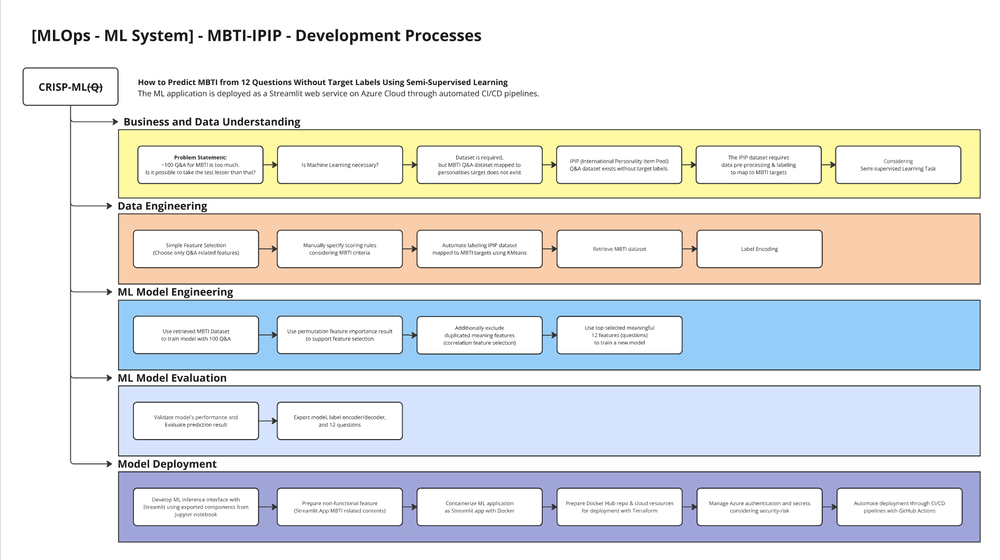

# MBTI - IPIP
*Know your MBTI within 12 questions through ML model deployed with streamlit on Azure cloud*

*patcharanat p.*

***Non-commercial Project***

## Introduction

Taking nearly 100 questions to know your MBTI could take a lot of time. How about knowing your MBTI within 12 questions? predicted by Machine Learning deployed with Streamlit on Azure Cloud.


## Output


## Table of Contents

1. [Getting Started](#1-getting-started)
2. [Model Development](#2-model-development)
3. [Authentication](#3-authentication)
4. [Deployment](#4-deployment)
5. [Appendix](#5-appendix)
    - [About Dataset](#about-dataset)
    - [Mapping Personalities IPIP to MBTI](#mapping-personalities-ipip-to-mbti)
    - [MBTI Contents](#mbti-contents)

## Prerequisites

- Python
- Microsoft Azure with available subscription
- Azure CLI SDK (`az`)
- Docker Hub Account
- Terraform (+Set to `$PATH`)
- Add the following file:
    - `./mbti_ipip/terraform/terraform.tfvars`
        ```shell
        subscription_id = "XXX-XXX-XXX-XXX-XXX"
        client_id = "XXX-XXX-XXX-XXX-XXX"
        client_secret = "XXXXXXXXXX"
        tenant_id = "XXX-XXX-XXX-XXX-XXX"

        location = "XXXX XXX"
        registry_username = "XXXX" # Docker Hub Username
        registry_password = "XXXX" # Docker Hub Password
        ```
    - `./mbti_ipip/terraform/backend/terraform.tfvars`
        ```shell
        subscription_id = "XXX-XXX-XXX-XXX-XXX"
        client_id = "XXX-XXX-XXX-XXX-XXX"
        client_secret = "XXXXXXXXXX"
        tenant_id = "XXX-XXX-XXX-XXX-XXX"

        location = "XXXX XXX"
        ```
        - Please refer to [3. Authentication](#3-authentication) for more details.

## 1. Getting Started

This sub-project is quite also focused on data science methodology besides from MLOps, including initiating a problem, how we use ML to solve the problem, and how we wrangle and label the data to meet the requirement. Even though MLOps practices, especially ML model deployment, still play a crucial role to deliver developed ML as an usable product as a web service with docker container, streamlit, and Azure cloud Web App service.

- Core component for the project consist of:
    - [Dockerfile](Dockerfile)
        - containerize ML application.
    - streamlit/[requirements.txt](./streamlit/requirements.txt)
        - dependency of the application required in the container.
    - streamlit/[main_app.py](./streamlit/main_app.py)
        - Streamlit App (Web-based UI)
    - streamlit/models/*
        - Contained ML model, Encoder/Decoder, and list of input questions used in Streamlit App
    - streamlit/mbti_info/*
        - Contained application's text contents
    - streamlit/picture/*
        - Contained application's picture contents
    - terrform/*
        - Code for deployment on cloud
- To run application locally for development, demo or testing, please enable `pyenv` in root working directory before and then run this:
    ```bash
    # workdir .
    streamlit run mbti_ipip/streamlit/main_app.py
    ```

## 2. Model Development



For ML Model Development Please refer to another associate project:
- [ML-Sandbax - mbti_ipip - GitHub patcha-ranat](https://github.com/patcha-ranat/ML-Sandbox/blob/main/mbti_ipip/model_dev.ipynb)

## 3. Authentication


### Overview

1. Login with Azure CLI `az login` to authenticate with owner account
2. Use the owner account to create rbac Service Principal by `az sp create-for-rbac ...`
3. Retrived Service Principal detail (client_id, cliend_secret, tenant_id)
4. Login with retrieved Service Principal detail for account impersonation
5. Use the login session to authenticate with Terraform provisioning Azure Cloud resources for terraform remote backend.
6. Provisioned resource (Storage Account) will provide key string to make Terraform, which will execute in CI/CD Pipeline, can access to Blob storage and store its backend remotely on it. We save this key and store it in GitHub Secrets.
7. Store Service Principal detail to GitHub Secrets.
8. When CD pipeline build and push a new image version to Docker Hub, it requires Docker Login session. So, we have to Store Docker Hub Email and Password in GitHub Secrets.
9. When CD pipeline deploy the new image version to Web App Service either through Terraform or Azure CLI, it also needs Azure Login session.
10. To pulling the image from private repository on Docker Hub, Web App Service required Docker Hub Email and Password which can be passed when first provisioning Web App Service resource.

### Implementation Detail

In Azure Cloud, there are multiple authentication methods that you can choose to match your specific needs such as Service Principal, Managed Identity, and etc. However, I will use Service Principal with Client Secret which is the most easiest to implement, but still being in the overall common practices. 

***Service Principal*** (SP) is similar to *Service Account* in GCP. It's intended to have least permissions to interact with a resource according to security purpose. We will enable SP for provisioning cloud resources through Terraform or Azure CLI. To create SP, you can achieve it through Azure Portal (Web UI) or through Azure CLI (`az`).

### 1. Creating Service Principal with Azure CLI
- first we'll need to login through `az`

    ```bash
    az login

    az account set --subscription "subscription_id"

    # check result -- attribute `id` is your subscription_id for owner account
    az account list
    ```

    *Please, note that you may encounter difficulty in authenticating Azure with Git Bash. Switching terminal type to powershell, Ubuntu, etc. for authentication first, and then switching back to Git Bash is worked for me (output from `az login` is shared within host machine regardless of terminal type or session)*

    ```bash
    az ad sp create-for-rbac \
        --display-name kmlops-sp \
        --role Contributor \
        --scopes subscriptions/<subscription_id>(/<optional>)
    ```
    *Please, also note that you can specify more of `--scopes` after subscription to make SP having lesser permission specific to resources which is a better practice.*
- It will give output as:
    ```json
    {
        "appId": "REDACTED", // client id
        "displayName": "sp-display-name",
        "password": "REDACTED", // client secret
        "tenant": "REDACTED" // tenant id
    }
    ```
    We will futher use this output either in Terraform or Azure CLI for account impersonation

### 2. Creating Service Principal with Azure Portal
- Creating SP
    - `Microsoft Entra ID (formerly Azure Active Directory (Azure AD))` >> `App registrations` >> *create SP*
    - `App registrations` >> newly created SP >> `Certificates & secrets`
        - You can get `client ID`, `tenant ID` in SP page within `App registrations`.
        - In `Certificates & secrets` >> `New client secret` >> *get Secret **Value** for client secret*.
- Grant Role
    - `Bill access control (IAM)` >> `Access control (IAM)` >> *Add, choose Contributor Role and search your SP with display-name*

As GCP-familiar data engineer, I find this part frustrating by non-beginner-friendly documentation and inconsistent cloud service names which make it much more harder to explore and search for information. Please refer to this [thread](https://stackoverflow.com/a/72483319) for more detail on App registrations and Service Principle.

References:
- [Demystifying Service Principals – Managed Identities - Dev Blogs Microsoft](https://devblogs.microsoft.com/devops/demystifying-service-principals-managed-identities/)
- [What is Azure Service Principal? - Stack Overflow](https://stackoverflow.com/a/48105935)
- [Creating SP via Azure Portal - Microsoft Official Documentation](https://learn.microsoft.com/en-us/entra/identity-platform/howto-create-service-principal-portal)
- [Azure Provider: Authenticating using a Service Principal with a Client Secret - Terraform Official Documentation](https://registry.terraform.io/providers/hashicorp/azurerm/latest/docs/guides/service_principal_client_secret.html)
- [Create an Azure service principal with Azure CLI - Microsoft Official Documentation](https://learn.microsoft.com/en-us/cli/azure/azure-cli-sp-tutorial-1?tabs=bash)
- [az ad sp create for rbac - Microsoft Official Documentation](https://learn.microsoft.com/en-us/cli/azure/ad/sp?view=azure-cli-latest#az-ad-sp-create-for-rbac)

## 4. Deployment

I included 2 approaches of deployment in this sub-project:
1. Azure CLI and CI/CD Pipeline
2. Terraform and CI/CD Pipeline

### 4.1 Azure CLI and CI/CD Pipeline

We have to create docker hub repo first via Docker Hub Web UI before proceeding to the next step. You might also need to change some variables to match your case.

#### 4.1.1 Recheck Image Result

Before we push the image to public/private registry, we should always check content contained in the image if it's not sensitive, safe to be deployed or not, and also check if the image works properly as expected. 

```bash
# workdir: .

# docker build -t <image-name>:<tag> <dockerfile-location-relative-to-current-workdir>
docker build -t <image-name>:<tag> mbti_ipip/.

# test running on local
docker run -p 8501:8501 <image-name>:<tag>

# check http://localhost:8501

# check files inside the container while running
docker exec -it <container-id> bash

# check for sensitive content contained in the container by overriding image entrypoint
docker run -it --entrypoint bash <image-name>:<tag>

docker stop <container-id>
```

#### 4.1.2 Manual Build

You may need to authenticate first for Docker Hub

```bash
docker login
```
```bash
# workdir: .

# docker build -t <image-name>:<tag> <dockerfile-location-relative-to-current-workdir>
docker build -t <image-name>:<tag> mbti_ipip/.

# Rename image
docker tag <image-name>:<tag> <dockerhub-username>/<repo-name>:<tag>

# Push to Docker Hub
docker push <dockerhub-username>/<repo-name>:<tag>
```

- In before revised version, I configure Azure app service in Azure cloud manually. please refer to references below to deploy on cloud as online application through Azure Web UI (Azure Portal).
- To prepare Streamlit app for production, you can find more details at [Official Documentation from Streamlit](https://docs.streamlit.io/deploy/tutorials/docker)

References:
- [Pushing Docker Image to Docker Hub - Youtube - Shaw Talebi](https://youtu.be/pJ_nCklQ65w?si=C0T-OnEd_BbAvsdV&t=1035)
- [How to deploy and test docker container websites using Azure app service - Youtube - LetMeTechYou](https://youtu.be/Fl9AIKj8UAY?si=hnUq7S4ut8v7-zEj&t=228)

#### 4.1.3 Manual Deploy

If we decided to deploy application through Azure CLI, we have to provision cloud resources at the first time, then the rest after that will be handled by CI/CD pipeline.

- First, we'll need to login with newly created SP:
    ```bash
    az login \
        --service-principal \
        -u <client-id> \
        -p <client-secret> \
        --tenant <tenant-id>

    # you should see servicePrincipal type from output
    az account list
    ```
- resource group
    ```bash
    az group create \
        --name <resource-group-name> \
        --location <location>
    # az group delete --name <resource-group-name>
    ```
- app service plan
    ```bash
    az appservice plan create \
        -g <resource-group-name> \
        -n <app-service-plan-name> \
        --is-linux \
        --sku F1 \ # cluster type
        --location <location>
    # az appservice plan delete --name <app-service-plan-name> --resource-group <resource-group-name>
    ```
- webapp
    ```bash
    # for docker hub public repo
    az webapp create \
        --name <web-app-name-or-url-domain> \
        --resource-group <resource-group-name> \
        --plan <app-service-plan-name> \
        -i <namespace>/<repo-name>:<tag>

    # for docker hub private repo
    az webapp create \
        --name <web-app-name-or-url-domain> \
        --resource-group <resource-group-name> \
        --plan <app-service-plan-name> \
        -i <namespace>/<repo-name>:<tag> \
        --container-registry-user <docker-email> \
        --container-registry-password <docker-password>
    
    # az webapp delete --name <web-app-name-or-url-domain> --resource-group <resource-group-name>
    ```

Now, you can access your ML App through `<web-app-name>.azurewebsites.net` URL.

Note
- For Azure, you can find list of available region/location here:
    - https://learn.microsoft.com/th-th/industry/sustainability/sustainability-data-solutions-fabric/deploy-availability
    - https://www.azurespeed.com/Information/AzureRegions

References:
- [Manage Azure Resource Groups by using Azure CLI - Microsoft Official Documentation](https://learn.microsoft.com/en-us/azure/azure-resource-manager/management/manage-resource-groups-cli)
- [Azure CLI az appservice plan - Microsoft Official Documentation](https://learn.microsoft.com/en-us/cli/azure/appservice/plan?view=azure-cli-latest)
- [Azure CLI az webapp create - Microsoft Official Documentation](https://learn.microsoft.com/en-us/cli/azure/webapp?view=azure-cli-latest#az-webapp-create)

#### 4.1.4 Azure CLI CI/CD Pipeline

For CI/CD Pipeline, there is an only file related to this section:
- [ipip-mbti-build-deploy.yml](../.github/workflows/ipip-mbti-build-deploy.yml)

The file operated with the same steps as manual execution in the previous topic, but with GitHub Action Runner:
1. Build
    1. Login to Docker Hub
    2. Build image from the GitHub repo with specified Dockerfile path
    3. Push built image to specified repo (public/private)
4. Deploy
    1. Login to Azure
    2. Deploy Web App with specified image version
    3. Echo result such as App URL, image repo, image version
    4. Azure logout

*Note that CI/CD pipeline do not provision resources such as resource group or service plan. Instead, it re-deploy (re-provisioning) existing web app service with a newer version of image*

Anyway, there're some more worth noting:
- We have to manually deploy Web App first time before deploying through CI/CD Pipeline because it requires some resources to be pre-exist which are resource group, App Service Plan, and Web App first version.
- To authenticate with *Azure Login action*, we need to specify GitHub Action secret: `AZURE_CREDENTIALS` manually with these attributes:
    ```json
    {
        "clientSecret": "REDACTED", // client secret
        "subscriptionId": "REDACTED", // subscription id
        "tenantId": "REDACTED", // tenant id
        "clientId": "REDACTED" // client id
    }
    ```
    - Please note that `--sdk-auth` is deprecated and `--json-auth` is not worked as expected for me. So, manual creating this json is required.
- You also might need to set `DOCKERHUB_EMAIL` and `DOCKERHUB_PASSWORD` in GitHub Secrets to make *Docker Login action* become applicable.
- ***Managed Identity*** in Azure Cloud use `client-id`, `tenant-id`, `subscription-id`, and additional setup to avoid storing long-lived credentials (so, no `client secret`) for authentication. Please, refer to references below for more details *(Azure Login Action)*.

References:
- [Deploy a custom container to App Service using GitHub Actions - Microsoft Official Documentation](https://learn.microsoft.com/en-us/azure/app-service/deploy-container-github-action?tabs=service-principal)
- [Docker Build GitHub Actions - dockerdocs](https://docs.docker.com/build/ci/github-actions/)
- [Azure Login Action - Azure GitHub](https://github.com/Azure/login?tab=readme-ov-file#azure-login-action)

Although using CI/CD Pipeline with CLI commands for deployment is simple and easy to setup, there're some drawback in this approach such as:
1. It required some resources to be manually provisioned before automated deployment which may not appropriate for production stage.
2. Cloud resources can't be versioning lead to unable to track changes and it's more harder to monitor cloud resources properties without representing as code.

### 4.2 Azure Terraform and CI/CD Pipeline

For enterprise-scale projects or projects that intensively operate on the cloud, I think it's more appropriate to adopt *Terraform* in architecture dedicated to more mature deployment, even it have the same level of rollback capability.

In this section, building image process is not different from the previous section. But for deployment, I will utlize **Terraform** for automated (or manual) Azure web service deployment.

#### 4.2.1 Terraform Remote Backend

Before we proceed to deploying the app through Terraform, I want to elaborate on enabling Terraform Remote Backend. In order to make Terraform available for automation execution (e.g. CI/CD pipeline) or collaboration between developers, we needs to store `tfstate` file on cloud, in this case is Blob storage.

So, we have to first create the Blob storage before provisioning application-related resources

```bash
# workdir ./mbti_ipip/terraform/backend
terraform init
terraform plan
terraform apply
```

You might get `tfstate` file for backend-related provisioning as an output, please keep this as sensitive information. You can later use this state file for destroying backend-related provisioned resources.

**Every time** private storage account is created, it will also create **a new key** for accessing the storage. We called this `ARM_ACCESS_KEY` retrieved by:

```bash
az storage account keys list \
    --resource-group '<resource-group>' \
    --account-name '<storageaccountname>' \
    --query '[0].value' \
    -o tsv
```

If you want to provision application-related (Main Terraform) locally, you have to export `ARM_ACCESS_KEY` with the retrieved string:

```bash
export ARM_ACCESS_KEY=<key-string>
```

Please, also add this key to GitHub Secrets with `ARM_ACCESS_KEY` name to make Main Terraform in CI/CD pipeline be able to access remote backend on the Blob storage.

References:
- [How to enable Terraform remote backend on Azure - Microsoft Official Documentation](https://learn.microsoft.com/en-us/azure/developer/terraform/store-state-in-azure-storage?tabs=azure-cli)
- [Terraform Storage Container Code - Official Terraform Docs](https://registry.terraform.io/providers/hashicorp/azurerm/latest/docs/resources/storage_container)

#### 4.2.2 Manual Deploy

Now, we can easily provision application-related cloud resources or make changes on it.

```bash
# workdir ./mbti_ipip/terraform
terraform init
terraform fmt
terraform validate
terraform plan
terraform apply
# terraform destroy
```

Please, note that Terraform use `terraform.tfvars` in local execution which we hide it from repository. So, we need these secret variables when it execute via CI/CD pipeline. We will talk about it in the next section.

References:
- [Terraform Azure Authentication (CLI) - Official Terraform Docs](https://registry.terraform.io/providers/hashicorp/azurerm/latest/docs/guides/azure_cli)
- [Linux Web App Terraform - Official Terraform Docs](https://registry.terraform.io/providers/hashicorp/azurerm/latest/docs/resources/linux_web_app#example-usage)
- [Terraform create app service for linux container - Stack Overflow](https://stackoverflow.com/a/75997774)
- [Create App Service app using a Terraform template - Microsoft Official Documentation](https://learn.microsoft.com/en-us/azure/app-service/provision-resource-terraform)

#### 4.2.2 Terraform CI/CD Pipeline

Relevant file: [ipip-mbti-terraform-build-deploy](../.github/workflows/ipip-mbti-terraform-build-deploy.yml)

Since we have already taken care of remote backend, we just have to worry about supplying secret variables to CI/CD pipeline.

I read many articles about this and they suggest that we can use multiple `.tfvars` files for specifying different variables for each environment and let CI/CD pipeline point to it (by `-var-file="path/to/tfvars"`) for provisioning resources for different environments. The conventional way to specify secrets is to use `TF_VAR_...` approach instead of hard-coding it to `.tfvars`.

However, for simplicity, I hard code my secrets to `.tfvars` file and hide it from this public repository. Either storing secrets in `.tfvars` or not, we still need to specify secrets in GitHub Secrets to assign secrets to `TF_VAR_...` for the CI/CD pipeline.

*Note that it's possible to use `.env` file to store Terraform secrets, but it's not implemented in this sub-project. Please refer additional information in reference below*

Additional from `AZURE_CREDENTIALS` and `ARM_ACCESS_KEY`, please also add these secrets to GitHub Secrets with associated detail to use in Terraform CI/CD pipeline authentication:
- `AZURE_SUBSCRIPTION_ID` : will be assigned as `TF_VAR_subscription_id`
- `AZURE_CLIENT_ID` : will be assigned as `TF_VAR_client_id`
- `AZURE_CLIENT_SECRET` : will be assigned as `TF_VAR_client_secret`
- `AZURE_TENANT_ID` : will be assigned as `TF_VAR_tenant_id`

With corrected setting up Terraform, Steps, and Secrets, we will be able to deploy Azure resources through Terraform CI/CD pipeline successfully. Please note that first-time execution is not required besides from remote backend related resources.


References:
- Best Practices
    - [Best practice for Terraform CI/CD 1 - Buildkite](https://buildkite.com/resources/blog/best-practices-for-terraform-ci-cd/)
    - [Best practice for Terraform CI/CD 2 - Spacelift](https://spacelift.io/blog/terraform-in-ci-cd)
    - [Terraform CI/CD Pipeline Example - GitHub - hashipcorp - setup-terraform](https://github.com/hashicorp/setup-terraform)
- Storing Secrets
    - [Conventional way to store secret is to use `TF_VAR_...` - HashiCorp Discuss](https://discuss.hashicorp.com/t/reference-environment-variables-in-tfvars-file/35475)
    - [Using `.env` file for Terraform Usage - Stack Overvlow](https://stackoverflow.com/questions/59789730/how-can-i-read-environment-variables-from-a-env-file-into-a-terraform-script)
    - [Detail for `TF_VAR_...` Usage - Official Terraform Docs](https://developer.hashicorp.com/terraform/language/values/variables#environment-variables)
- Additional Terraform techniques
    - [Additional way to specify variable in Terraform CLI `-var` - Official Terraform Docs](https://developer.hashicorp.com/terraform/language/values/variables#variables-on-the-command-line)
    - [What is `.tfvars` file - Spacelift](https://spacelift.io/blog/terraform-tfvars)
    - [Detail for using `.tfvars` - Official Terraform Docs](https://developer.hashicorp.com/terraform/language/values/variables#variable-definitions-tfvars-files)
    - [Specifying Terraform file in directories for execution (`-chdir`) - Official Terraform Docs](https://developer.hashicorp.com/terraform/cli/commands#switching-working-directory-with-chdir)

## 5. Appendix
### About Dataset
- [Big Five Personality Test - Kaggle](https://www.kaggle.com/datasets/tunguz/big-five-personality-test)
- [Local Data Dict](./data/codebook.txt)
- [International Personality Item Pool](https://ipip.ori.org/)
- [Converting IPIP Item Responses to Scale Scores](https://ipip.ori.org/newScoringInstructions.htm)
- [Big-Five Factor Markers - Questions Classification](https://ipip.ori.org/newBigFive5broadKey.htm)
- [Interpreting Individual IPIP Scale Scores](https://ipip.ori.org/InterpretingIndividualIPIPScaleScores.htm)
- [MBTI - Letters personalities explain](https://www.16personalities.com/articles/our-theory)

### Mapping Personalities IPIP to MBTI
- Factor I (EXT questions)
    - Surgency or Extraversion = Introversion or Extroversion (I/E)
- Factor II (AGR questions)
    - Agreeableness = Thinking or Feeling (T/F)
- Factor III (CSN questions)
    - Conscientiousness = Judging and Perception (J/P)
- Factor IV (EST questions)
    - Emotional Stability = Turbulance or Assertive (T/A)
- Factor V (OPN questions)
    - Intellect or Imagination = Sensors or Intuitives (S/N)

---
